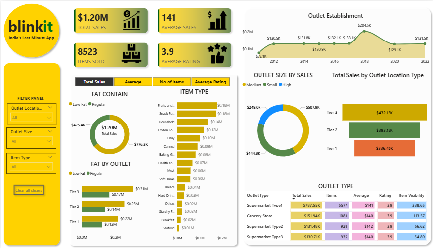

# 🟡 Blinkit Sales Dashboard — Power BI

A comprehensive sales analytics dashboard built in Power BI 
for Blinkit (India's Last Minute App) grocery data.

## 📊 Dashboard Overview
- **Total Sales:** $1.20M
- **Average Sales:** $141
- **Items Sold:** 8,523
- **Average Rating:** 3.9

## 📌 Key Insights
- Sales by Fat Content (Low Fat vs Regular)
- Item Type performance analysis
- Outlet Size & Location Type comparison
- Outlet Establishment trend (2012–2022)
- Outlet Type breakdown

## 🗂️ Files Included
| File | Description |
|------|-------------|
| `DashBoard.pbix` | Main Power BI report file |
| `BlinkIT Grocery Data.xlsx` | Raw data source |
| `Images/` | KPI icon assets |

## 🛠️ Tools Used
- Microsoft Power BI Desktop
- Microsoft Excel

## 🚀 How to Use
1. Download `DashBoard.pbix`
2. Open with [Power BI Desktop](https://powerbi.microsoft.com/desktop)
3. If data doesn't load, re-link `BlinkIT Grocery Data.xlsx` 
   via Transform Data → Data Source Settings

## 📷 Dashboard Preview

## 👤 Author
**Deepraj Patel**
